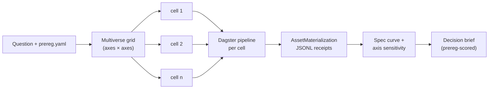

# diageo-research

A Hypothesis Workbench for strategy questions. You ask one question, the agent
fans the question out across a grid of defensible specifications (which
taxonomy to apply, which cohort to centre, which time window to weight), runs
each cell as an independent multi-agent research pipeline, and reports back the
recommendations that survive every framing — plus the framings that flip the
conclusion. Outputs are decision briefs grounded in real public datasets
(BLS, Census, FRED, TTB, BEA, StatCan), not prose-only summaries.

What makes it different from a generic "agent + web browse" toolchain: the
workbench treats every cell as a Dagster asset with explicit lineage,
pre-registers the decision rule and falsifier conditions before any cell runs,
spec-curves the result so a single brittle framing cannot drive the
recommendation, caps Anthropic spend per cell via pessimistic reservation, and
exposes the whole surface as MCP tools so a chat client can drive it end to
end. The deliverable is decision-grade rigor (multiverse + spec curve +
pre-registration + falsifiers + cost guardrails + Dagster lineage + MCP),
not "another research bot."

## Quickstart

This project uses [`uv`](https://docs.astral.sh/uv/) for environment and lock
management. The lockfile is `uv.lock`.

```bash
git clone <repo> diageo-research && cd diageo-research

uv sync                                  # builds .venv from uv.lock

cp .env.example .env                     # then fill in ANTHROPIC_API_KEY
                                         # (FRED / BLS / BEA keys are optional)

uv run playwright install chromium       # only if you intend to run with web_browse on
                                         # (studies default to --no-browse)

uv run diageo ingest                     # registers ./data/*.parquet as DuckDB views

# A) Single research run — fastest way to see the pipeline end-to-end
uv run diageo research "Where are recent price changes having the biggest impact on North American spirits demand?"

# B) Multiverse study — pre-registered, eight cells, capped at $1.50/cell
uv run diageo study samples/study_pricing_pressure.yaml --no-browse --max-cost 1.50

# Workbench UI + MCP server (run in two terminals)
uv run diageo serve                                    # http://127.0.0.1:8765/
uv run diageo mcp -u http://127.0.0.1:8765             # stdio MCP, point Cursor / Claude at this
```

When the study finishes, the CLI prints
`http://127.0.0.1:8765/?study=<study_id>` — open that URL to drop straight
into the right study (the listing dropdown does not auto-refresh on every
disk-level change, so the explicit URL is the reliable hand-off).

Two smoke checks confirming the install:

```bash
uv run pytest -q                                       # expect: 155 passed
curl -s http://127.0.0.1:8765/assets/graph | uv run python -c "import json,sys;print(len(json.load(sys.stdin)['nodes']))"
                                                       # expect: 6
```

A six-node asset graph means the Dagster pipeline is wired and the FastAPI
app is reading from it. Tests cover orchestration, multiverse expansion,
cost guardrails, the Dagster asset graph, the MCP server, and the report
writers.

Cost note: `--no-browse` is the highest-leverage cost lever — every
`web_browse` call is a paid Sonnet round-trip and the local Chromium path
trips on Google / .gov CAPTCHAs. The eight-cell pricing-pressure study
runs unattended in roughly $5–$10 with browse off and `max_cost_usd=1.50`.

## How it works



Each cell is one Dagster run over six declared assets — `question_analysis →
personas → outline → interviews → verifier → synthesis` — keyed on a
`DynamicPartitionsDefinition` so a study can register one partition per
cell without a code redeploy.

- **Dagster asset graph as execution backbone.** `src/diageo_research/dagster_assets.py`
  declares the six-stage graph; `defs = Definitions(assets=ALL_ASSETS)` is the
  single source of truth that the workbench mermaid view, the asset graph
  endpoint, and the test pins all read from.
- **Multiverse expansion as cells over axes.** A YAML spec lists `axes` (e.g.
  occasion taxonomy, cohort emphasis, time window) with values; the runner
  takes the cartesian product, generates a deterministic `cell_id` per
  combination, and runs each cell against the same orchestrator with axis
  addenda merged into the prompt and per-cell overrides applied.
- **Provenance via per-stage manifests + receipts.** Every stage writes both a
  signed-shape `manifest.json` entry (input/prompt/code/output SHA-256, model
  id, elapsed_s) and a `dagster_materializations.jsonl` receipt. The lineage
  drawer and the MCP `get_run_manifest` / `list_run_materializations` tools
  read these directly — the workbench does not require a long-running Dagster
  webserver.
- **Cost guardrails via pessimistic reservation.** `CostTracker.reserve(...)`
  claims worst-case headroom against `max_cost_usd` *before* each Anthropic
  call; if the reservation would breach the cap, `BudgetExceeded` is raised
  and the cell ends with `status=error`, `reason=budget_exceeded`, leaving a
  partial brief at `runs/<run_id>/final.md`.

## Commands

| Command | What it does | Primary outputs |
|---|---|---|
| `diageo ingest` | Scans `./data/*.parquet`, registers each as a DuckDB view, regenerates `prompts/dataset_schema.md`. | `data/main.duckdb`, `prompts/dataset_schema.md` |
| `diageo research "<question>"` | One-shot research run — analyses the question, sizes the panel, runs interviews, synthesises a brief. | `runs/<run_id>/{events.jsonl,manifest.json,final.md,stages/*}` |
| `diageo runs` | Lists all single-shot runs newest-first with status and question. | stdout table |
| `diageo report <run_id>` | Inspects one run; `--stage <name>`, `--all`, or `--final` to render specific artefacts. | stdout (rendered markdown) |
| `diageo events <run_id>` | Replays a run's `events.jsonl` through the live console observer; `--follow` to tail. | stdout (replay) |
| `diageo serve` | Launches the FastAPI workbench UI at `http://127.0.0.1:8765/`. | HTTP server |
| `diageo study <spec.yaml>` | Runs a multiverse study — one Dagster cell per grid point, with `--no-browse`, `--max-cost`, `--personas`, `--turns` overrides. | `runs/<study_id>/{study.json,prereg.yaml,spec_grid.yaml,spec_curve.json,spec_curve.md}` plus per-cell `runs/<study_id>_<cell_id>/...` |
| `diageo studies` | Lists all multiverse studies with status, cell counts, question. | stdout table |
| `diageo mcp -u <workbench-url>` | Runs the MCP server (stdio by default; `--transport sse` available) wrapping every workbench endpoint as a tool call. | stdio (MCP) |

## Workbench tour

UI lives at `http://127.0.0.1:8765/` once `diageo serve` is running. Pick a
study from the header dropdown or open with `?study=<study_id>`.

| Tab | What it shows |
|---|---|
| **DAG** | Live mermaid render of the six-asset Dagster graph for the selected cell; click a stage to open the lineage drawer (partition_key, model, spend, SHA-256 hashes from the per-stage manifest). |
| **Universe** | 2-D heatmap of cells across the first two axes, coloured by per-cell robustness across the spec curve. |
| **Compare specs** | Clustered recommendations + falsifier status, axis-sensitivity panel ("when we vary cohort, agreement drops 80% → 50%"), per-cell cost histogram. |
| **Cost** | Full-page replica of the histogram with cap-aware bars and the study-wide rollup. |
| **Tool calls** | Every `web_browse`, `web_fetch`, `duckdb_query` with outcome — so "disabled by guardrails" or "hit cell cap" is visible. |
| **Personas** | Drill into one persona's transcript and sub-report. |
| **Decision brief** | Final synthesised brief, scored against the pre-registered decision rule. |

Slash-command bar at the bottom (`/help` for the full list):

| Command | What it does |
|---|---|
| `/help` | Toast-prints the full command list. |
| `/lineage [cell] [stage]` | Opens the lineage drawer for a cell × stage. |
| `/cell <id>` | Focuses a cell across all tabs. |
| `/sensitivity` | Compare-specs tab with the axis-sensitivity panel. |
| `/universe` | Heatmap matrix view. |
| `/cost` | Cost tab. |
| `/brief` | Decision-brief tab. |
| `/dag` | DAG view for the focused cell. |
| `/tools` | Tool-calls tab. |
| `/personas` | Personas tab. |

## Dagster orchestration

For demos, audits, and anyone who wants to see the asset graph in its
native form, point `dagster dev` at the same `Definitions` object the
workbench uses. Three terminals:

```bash
# Terminal 1: workbench API + SSE
uv run --env-file .env.local diageo serve     # → http://127.0.0.1:8765/

# Terminal 2: Dagster UI (Dagit) — asset graph, partitions, run history
diageo dagster-dev                            # → http://127.0.0.1:3000/

# Terminal 3: Next.js Hypothesis Workbench
cd web-ui && pnpm dev                         # → http://localhost:3001/workbench
```

The Dagster UI is the source of truth for asset lineage, partition
history, and materialization receipts. Use it to launch runs, drill into
a step's stdout/stderr, and walk the asset graph in its native form. The
`web-ui` workbench at `:3001` wraps the same data with decision-grade
framing (multiverse cells, spec curve, pre-registration, falsifiers) for
stakeholder reviews.

`diageo dagster-dev` sets `DAGSTER_HOME=./.dagster_home`, copies the
repo-root `dagster.yaml` into it (so the SqliteRunStorage /
SqliteEventLogStorage / SqliteScheduleStorage providers actually take
effect), and launches `dagster dev` against `workspace.yaml` — which
loads `diageo_research.dagster_assets` as a code location. The
`.dagster_home/` directory is gitignored; run history accumulates there
across restarts.

Backfill the UI with materializations from earlier ephemeral runs:

```bash
DAGSTER_HOME=$(pwd)/.dagster_home uv run \
    python scripts/seed_dagster_from_runs.py
```

That script reads each `runs/<id>/dagster_materializations.jsonl` and
reports the rows as runless `AssetMaterialization` events into the
persistent instance — so a freshly-launched Dagit shows the same
provenance the workbench already shows from disk, without re-running
any LLM calls.

When the FastAPI server (`diageo serve`) and `diageo study` are launched
while `DAGSTER_HOME` is set in the environment, the in-process
materializer also writes into the persistent instance, so new runs
appear in Dagit immediately alongside the seeded history.

## MCP integration

`diageo mcp` wraps the workbench HTTP API as MCP tools, so Cursor / Claude
Desktop / Claude Code can drive the same views from chat. Default transport
is stdio.

```jsonc
// Cursor: ~/.cursor/mcp.json
// Claude Desktop: ~/Library/Application Support/Claude/claude_desktop_config.json
// Claude Code: ~/.config/claude/mcp.json (or ./mcp.json in the project)
{
  "mcpServers": {
    "diageo-workbench": {
      "command": "uv",
      "args": ["--directory", "/absolute/path/to/diageo-research",
               "run", "python", "-m", "diageo_research.mcp_server"],
      "env": { "WORKBENCH_URL": "http://127.0.0.1:8765" }
    }
  }
}
```

Run `diageo serve` first so the FastAPI app is up at `WORKBENCH_URL`. The
MCP server exposes 11 tools, all backed by the same FastAPI endpoints:

| Tool | What it returns |
|---|---|
| `list_studies` | Recent studies (id, name, status, started_at). |
| `get_study` | Full study state — cells, axes, status, run ids. |
| `get_spec_curve` | Clustered recommendations + robustness fractions in `[0,1]`. |
| `get_axis_sensitivity` | Per-axis agreement on the lead recommendation. |
| `get_cost_rollup` | Total + per-cell Anthropic spend, cap, n_calls. |
| `list_run_materializations` | Per-stage `AssetMaterialization` records for a cell (hashes, model, spend). |
| `get_run_manifest` | Provenance manifest for a cell (input/output/code/prompt hashes). |
| `get_run_stage` | Markdown body of one stage artefact (`00_question`, `02_seed_outline`, …). |
| `get_asset_graph` | Declared Dagster asset graph (nodes + edges). |
| `list_recipes` | Saved YAML study specs in `samples/` — clone-and-parameterise templates. |
| `workbench_health` | Sanity check — `{ok, asset_count, edge_count, workbench_url}`. |

Pair this with [`dagster-mcp`](https://pypi.org/project/dagster-mcp/)
once you want a chat client to drive Dagit's GraphQL surface
(`get_runs`, `launch_job`, re-materialize a partition by name). With
`diageo dagster-dev` running, the Dagster webserver is up on
`http://127.0.0.1:3000` and GraphQL at `/graphql` is reachable — that's
what `dagster-mcp` connects to.

## Datasets

Each fetcher writes to `data/<source>.parquet`; `diageo ingest` registers each
parquet as a DuckDB view and rewrites `prompts/dataset_schema.md`.

| Script | View(s) | Source | Auth | Status |
|---|---|---|---|---|
| `fetch_bls_cpi.py` | `bls_cpi_alcohol` | BLS CPI alcoholic beverages (national + 4 regions + 3 metros), monthly 2015– | Free key (BLS_API_KEY) recommended | works |
| `fetch_census_retail.py` | `census_retail_4453` | US Census MRT NAICS 4453 (via FRED), monthly SA + NSA, 1992– | None | works |
| `fetch_fred.py` | `fred_macro` | FRED — real disposable income, real PCE, alcohol price index | None (FRED_API_KEY optional) | works |
| `fetch_ttb.py` | `ttb_spirits_*`, `ttb_wine_*`, `ttb_beer_*` | TTB national-report production / removal volumes | None | works (refresh URLs each TTB release) |
| `fetch_bls_ces.py` | `bls_ces_alcohol` | BLS Consumer Expenditure Survey — alcohol spend by income decile / age band, annual | Free key (BLS_API_KEY) recommended | works |
| `fetch_statcan.py` | `statcan_alcohol` | StatCan Table 10-10-0010-01 — Canadian alcohol sales, annual | None | works |
| `fetch_bea_pce.py` | `bea_pce_alcohol` | BEA NIPA 2.4.5U PCE — alcohol line items, annual | Free key (BEA_API_KEY), must be activated via the BEA confirmation email | works |
| `fetch_nhanes.py` | `nhanes_alcohol_use` | CDC NHANES ALQ × DEMO, 4 cycles | None | works (~80 MB XPT) |
| `fetch_nsduh.py` | `nsduh_alcohol` | SAMHSA NSDUH PUF — alcohol vars only | None | works (~50 MB STATA bundle; national only — state IDs are RDC-only) |

The MVP demo uses the first six (BLS CPI, Census 4453, FRED, TTB, BLS CES,
StatCan) — they load fast and cover the flagship pricing-impact and
festival-mix questions. NHANES and NSDUH are larger demographic surveys; run
them when you want race / age / health-survey angles. All sources are
public-domain or "citation requested" government data and are suitable for
client work with attribution.

Sources removed during May-2026 validation (left out rather than left as
broken stubs; commit history if you want to retry): NIAAA Surveillance
Reports (TLS), USDA ERS Food Availability (URL reorg), OECD Alcohol
Consumption (SDMX dataflow renamed), NHTSA FARS CrashAPI (503), INEGI ENIGH
(interactive registration), Google Trends (`pytrends` × `urllib3` v2).

## What's NOT in this repo yet

Honest list of things the workbench narrative implies but the repo does not
ship today:

- **Frontend rebuild.** `src/diageo_research/web/static/index.html` is the
  current single-file UI. The richer FE lives in a separate repo.
- **Prefect ↔ Dagster abstraction.** We picked Dagster (see below); there is
  no portable interface between orchestrators today.
- **Recipe / template library.** `samples/` has two YAML specs
  (`study_smoke.yaml`, `study_pricing_pressure.yaml`); a curated recipe
  catalogue is not yet in the repo.
- **Calibration tracking.** Pre-registration captures the holdout reservation
  and decision rule, but a calibration ledger that reads quarter-close actuals
  back into a Brier-score view is not implemented.
- **True backcasting.** `prereg.evidence_thresholds.backcasting_pass_min`
  exists in the YAML schema but the backcasting engine itself is Phase 2.
- **Signed manifests + bit-identical replay verification.** Manifests carry
  SHA-256 hashes per stage; reproducible-replay tooling that re-executes a
  manifest and bit-compares outputs is not yet wired.

## Architecture decisions

**Why Dagster.** We needed a declarative asset graph (each pipeline stage as
a typed asset with explicit upstream deps), dynamic partitioning (one
partition per multiverse cell, registered at study-launch time), and a
standard MCP path via `dagster-mcp` once a webserver is wired. Dagster
hits all three. The `Definitions` object is the single source of truth: the
mermaid view in the workbench, the `/assets/graph` endpoint, and the test
pins in `tests/test_dagster_assets.py` all introspect the same object.

**DagsterInstance: persistent when DAGSTER_HOME is set, ephemeral otherwise.**
Each cell's materializer (`orchestrator._run_dagster_materialize`) calls
`DagsterInstance.get()` when `DAGSTER_HOME` is set in the environment and
falls back to `DagsterInstance.ephemeral()` otherwise. The persistent
path keeps Dagit (`diageo dagster-dev`) populated with run history,
asset materializations, and compute logs across process restarts — its
storage providers are declared in the repo-root `dagster.yaml`
(`SqliteRunStorage`, `SqliteEventLogStorage`, `SqliteScheduleStorage`,
`LocalComputeLogManager`, `LocalArtifactStorage`) and the SQLite DBs
live under `./.dagster_home/` (gitignored). The ephemeral path keeps the
test suite hermetic and one-off CLI runs from polluting a shared DB.
Either way, every stage *also* writes our own per-cell
`dagster_materializations.jsonl` so the FastAPI workbench keeps
rendering lineage even when the Dagster webserver is not running — the
two surfaces are independent and read the same metadata.

## Models, pricing, budget caps

| Role | Model |
|---|---|
| Persona generation, final synthesis | `claude-opus-4-7` |
| Interviewer, perspective agents, section writers | `claude-sonnet-4-6` |

System prompts and the DuckDB schema description ride on Anthropic prompt
caching to keep per-turn cost low.

The cap is enforced. Setting `defaults.max_cost_usd: 2.50` in a YAML spec
caps each cell at $2.50 of Anthropic spend via pessimistic reservation: each
call reserves its worst-case cost upfront against the cap, the call runs,
the reservation reconciles to the actual usage, and any further call that
would breach the cap raises `BudgetExceeded`. The cell ends with
`status=error`, `reason=budget_exceeded`, and a partial brief at
`runs/<run_id>/final.md`.

```yaml
defaults:
  n_personas: 3
  max_turns: 3
  enable_web_browse: false   # highest-leverage cost lever
  max_browses_per_cell: 4    # belt-and-braces if a cell flips browse on
  max_cost_usd: 2.50         # pessimistic reservation; trips a partial brief, not a crash
```

CLI overrides for ad-hoc tightening:

```bash
uv run diageo study samples/study_pricing_pressure.yaml \
  --no-browse --max-cost 1.50 --personas 2 --turns 2
```

A warning prints if `max_cost_usd` is below the empirical floor for the
panel you have configured (~$0.15 question_analysis + $0.30 personas + $0.10
outline + $0.10 × n_personas × max_turns interviews + $1.00 synthesis); cells
will trip the guard mid-synthesis at that point and you will get a partial
brief instead of a finished one. Either raise the cap or shrink the panel.
